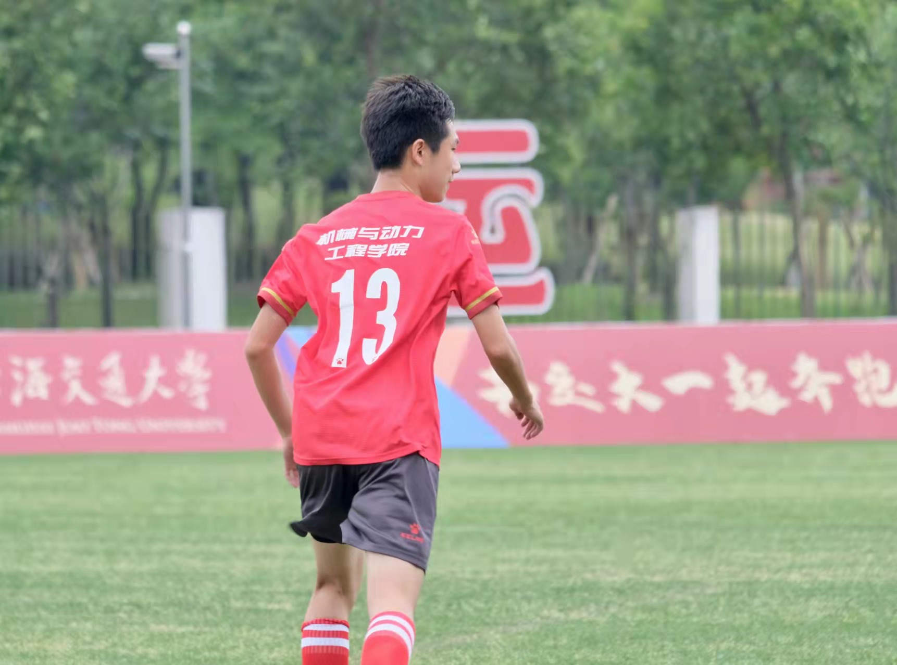

## About Me

I am a Ph.D. student at Purdue University.

## Research Interests
Micro and Nanoscale fluid mechanics, Rapid Electrokinetic Patterning, Advanced fluid control technique and electrokinetic flow simualtion at microfluidic level. 

## Education

- **[Feb. 2022 - Present]** PhD student, Purdue University 
- **[Aug. 2020 - Aug 2021]** M.S. Mechanical Engineering, Purdue University
- **[Sept. 2016 - Jul 2020]** B.S. Mechanical Engineering, Shanghai Jiaotong University
 
## Working experience

- **[Jun. 2021 - Dec. 2021]** Fluid Dyamic Engineer, Hirain, Beijing.  

## Publications

- **Time‐resolved particle image velocimetry analysis and computational modeling of transient optically induced electrothermal micro vortex**
   
Kshitiz Gupta, **Zhengwei Chen**, Stuart J Williams, Steven T Wereley
   
 Electrophoresis 2021
 
 - **Transient behavior of an optically induced electrothermal micro-vortex: Modelling and PIV analysis**
   
Kshitiz Gupta, **Zhengwei Chen**, Stuart J Williams, Steven T Wereley
   
Bulletin of the American Physical Society 2020

## Resume in pdf formate

[a relative link](./assets/img/zhengweichen_resume.pdf)

## For Fun

Soccer player

Painting amateur(almost lose that skill now)

